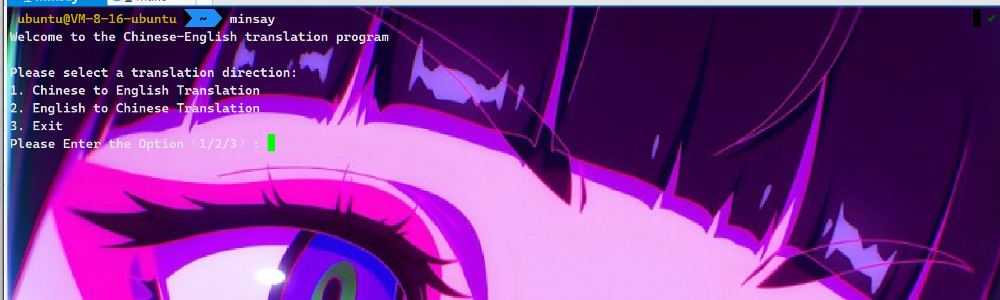

<!--
 * @Author: yowayimono
 * @Date: 2023-09-12 18:10:38
 * @LastEditors: yowayimono
 * @LastEditTime: 2023-09-12 18:24:18
 * @Description: nothing
-->
An English translation applet

It is written in python language, and supports Chinese-English translation. For the time being, only these functions can be used.

The purpose is to create a program that can be translated at the Terminal, because I often work at the Terminal, I don't want to go to the web search, and I can compare Chinese and English to help learn Chinese and English

Here's how to use it in the Terminal:

Add at the beginning of the file
```python
#!/usr/bin/python3
```

execute at the terminal
```shell
sudo chmod +x min.py
```
give executable permission,execute next
```shell
sudo mv min.py /usr/local/bin
```
rename him
```shell
sudo mv min.py min
```
Try it out


